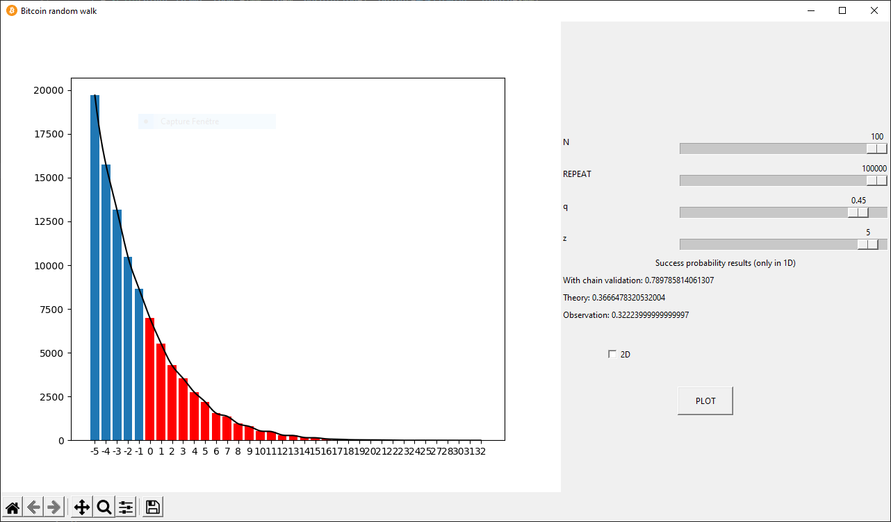
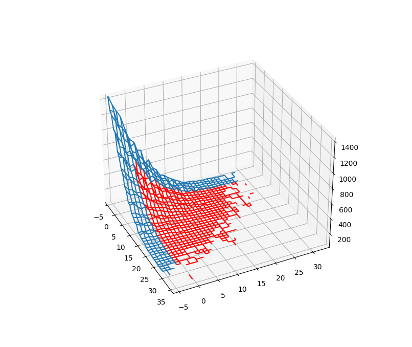

# binomial-random-walk
A binomial random walk visualization program in python

# Required dependencies

* matplotlib : https://matplotlib.org/stable/users/installing/index.html
* numpy : https://numpy.org/install/
* scipy : https://scipy.org/install/

# UI

### Overview

Once the program is started the following UI shows up:

### Figure view

On the left side a matplotlib plot window is displayed (empty at first).

To know more about how to use the plot interface please refer to :

* https://matplotlib.org/3.2.2/users/navigation_toolbar.html

### Control panel

The right panel contains the different parameters you can use and a plot button.

#### N slider

The N slider set the value of how many **random steps** must be performed on a **single** repetition.

A single repetition correspond to one random walk.

It's value range *between 10 and 100* (with 10 step)

#### REPEAT slider

The REPEAT slider set the value of how many **random walk**.

The purpose of this slider is to average the comportment of a single N step random walk.

It's value range *between 1000 and 100000* (with 1000 step)

#### 2D checkbox

This checkbox allows you to switch from a 1-D random walk to a 2-D random walk.
Both of them are recurrent since it is guaranteed to return to the starting position at some point (which is not in 3-D).

| 1-D                             | 2-D                             |
|---------------------------------|---------------------------------|
|  |  |

In red to the 1-D plot is added the interpolated curve to help you see the shape.

#### PLOT button

The button used to display the random walk outcome according to the chosen parameters.

